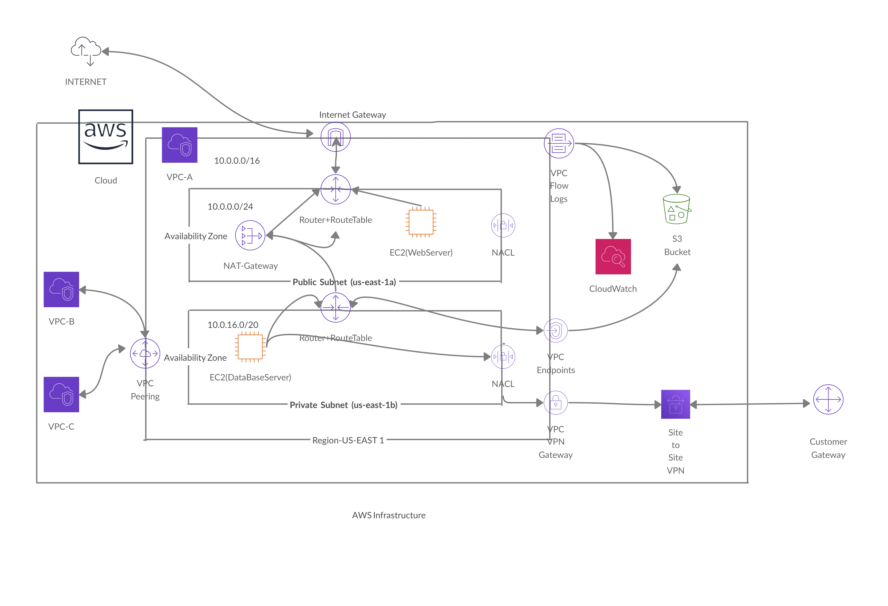
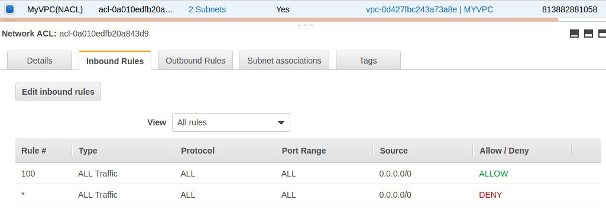
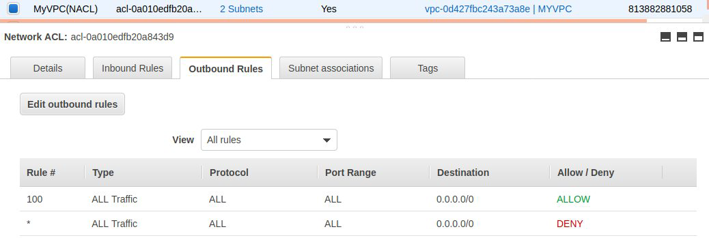
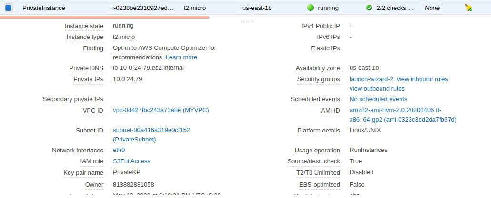
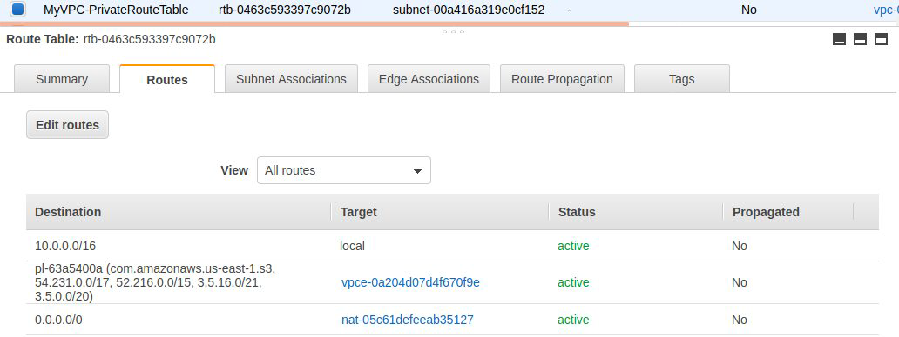
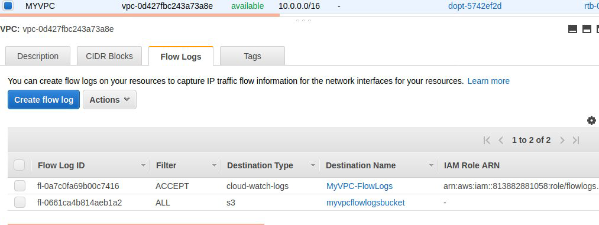

# AWS Architecture #

## Diagram ##
### The setup is concisely illustrated below. ###

## Description: ##
***This repository contains a YAML script to instantiate a minimally-functional AWS infrastructure as follows:
- Virtual Private Cloud (VPC) - CIDR Block (10.0.0.0/16)
 - Public Subnet - CIDR Block (10.0.0.0/24)
 - Private Subnet - CIDR Block (10.0.16.0/20)

1. Routing tables to facilitate communication between various constituents of the infrastructure and The Internet.
2. Empty EC2 instance is wrapped in a security group accepting SSH connections from the public subnet, any connection from its own subnet, and allows all outbound traffic.
3. All subnets can "dial-out" to WWW.
 - Public subnet through the Internet Gateway
 - Private subnet through the NAT Gateway, which in turn connects to the WWW through the Internet Gateway.
4. Provision an Internet Gateway and associate it with the VPC and edit the route in the Route Tables.
5. Provision an NAT Gateway to enable instances in private subnet to connect to the internet or other AWS services, but prevent     the internet from initiating a connection with those instances.
6. Provision an Custom NACL and associate Both Subnets (Private and Public)
 - Inbound Rules:

 
 - Outbound Rules:

 
7. Provision an VPC Gateway Endpoint (S3), it allows private ec2 instance to connect to AWS services using a private network, it remove the need of Internet Gateway, NAT etc to access AWS services.
 - Attach an IAM role to the private instance (S3-full Access)

 
 
 - Add Route to Private Route Table (Endpoint Gateway Route)
 
 

8. Flow Logs: It captures information about IP traffic going into your interfaces,it helps to monitor and troubleshoot connectivity issues
 
 - Flow logs are published to CloudwatchLogs and S3 Bucket:
  - Cloudwatch: Created an IAM role and attach it to the flow log in cloudwatch logs.
  - S3: Created an S3 Bucket, then in flow logs creation tab we added the Bucket ARN.
  
  - NOTE:
    A resource based policy will be created automatically and attached to the target bucket.

