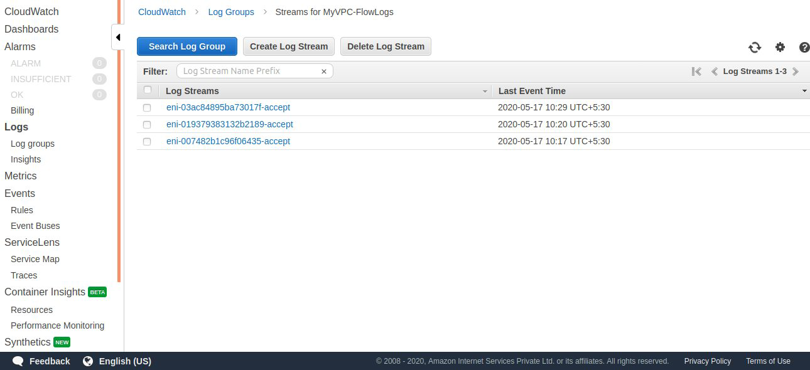
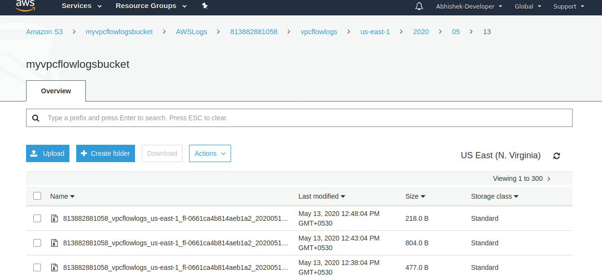
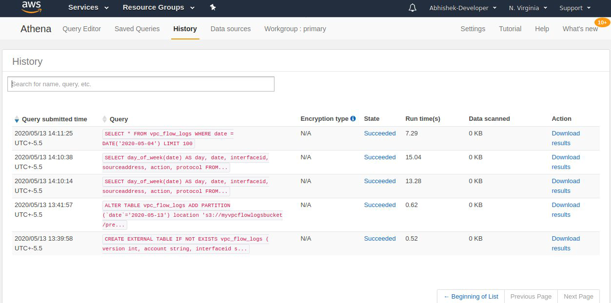
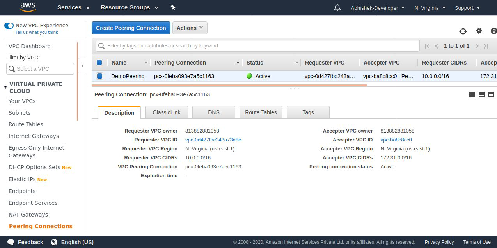
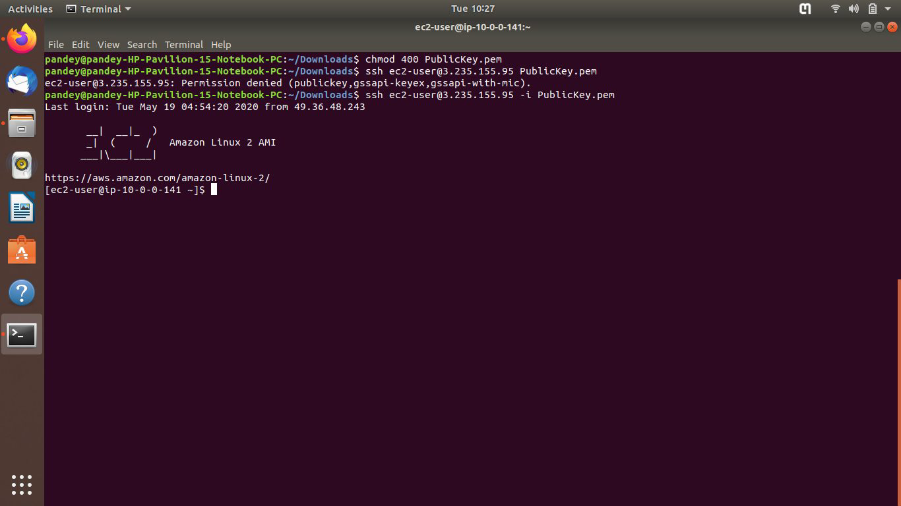
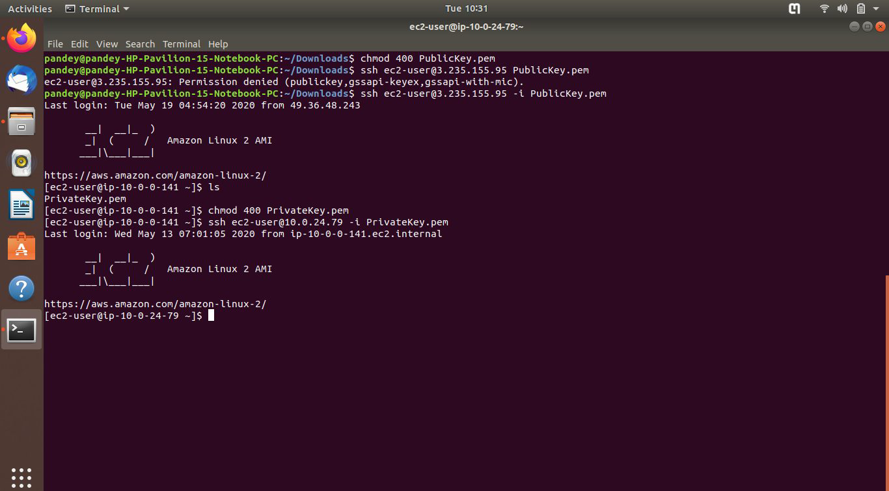
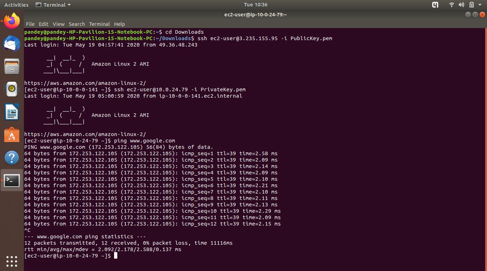
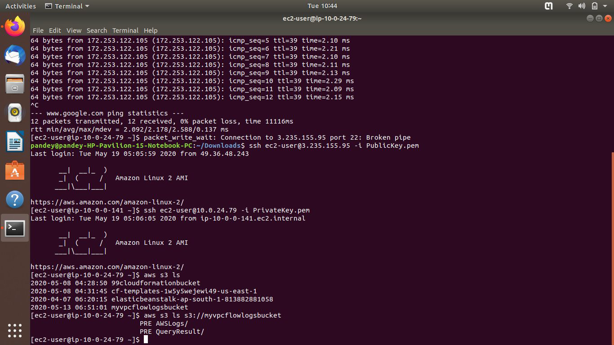

# AWS Architecture #

## Diagram ##
### The setup is concisely illustrated below. ###

## UseCase ##

Created an Amazon VPC to host multi-tier web applications and strictly enforce access and security restrictions between webservers,
application servers, and databases. You can launch webservers in an publicly accessible subnet and application servers and databases in non-publically accessible subnets. The application servers and databases can't be directly accessed from the Internet, but they can still access the Internet via a NAT Gateway to download patches, for example You can control access between the servers and subnets using inbound and outbound packet filtering provided by network access control lists and security groups. It supports a VPC peering connection between VPC A and VPC B, which are in the same AWS account, and do not have overlapping CIDR blocks. In this way, each VPC will be able to access each others' resources without restriction. It supports VPC Endpoints connection to access S3 Bucket, enables instances in VPC to use their private IP addresses to communicate with resources in other services. The instances do not require public IP addresses, a Internet gateway, a NAT device, or a virtual private gateway in VPC. It supports VPC flowlogs to capture the In/Out traffic of the entire VPC to Cloudwatch logs and to the S3 Bucket.

## Description: ##
This repository contains a YAML script to instantiate a minimally-functional AWS infrastructure as follows:
- Virtual Private Cloud (VPC) - CIDR Block (10.0.0.0/16)
 - Public Subnet - CIDR Block (10.0.0.0/24)
 - Private Subnet - CIDR Block (10.0.16.0/20)

1. Routing tables to facilitate communication between various constituents of the infrastructure and The Internet.
2. Empty EC2 instance is wrapped in a security group accepting SSH connections from the public subnet, any connection from its own subnet, and allows all outbound traffic.
3. All subnets can "dial-out" to WWW.
 - Public subnet through the Internet Gateway
 - Private subnet through the NAT Gateway, which in turn connects to the WWW through the Internet Gateway.
4. Provision an Internet Gateway and associate it with the VPC and edit the route in the Route Tables.
5. Provision an NAT Gateway to enable instances in private subnet to connect to the internet or other AWS services, but prevent the internet from initiating a connection with those instances.
6. Provision an Custom NACL and associate Both Subnets (Private and Public)
 - Inbound Rules:

 - Outbound Rules:

 
7. Provision an VPC Gateway Endpoint (S3), it allows private ec2 instance to connect to AWS services using a private network, it remove the need of Internet Gateway, NAT etc to access AWS services.
 - Attach an IAM role to the private instance (S3-full Access)

 
 
 - Add Route to Private Route Table (Endpoint Gateway Route)
 
 

8. Flow Logs: It captures information about IP traffic going into your interfaces,it helps to monitor and troubleshoot connectivity issues
 
 - Flow logs are published to CloudwatchLogs and S3 Bucket:
  - Cloudwatch: Created an IAM role and attach it to the flow log in cloudwatch logs.
  - S3: Created an S3 Bucket, then in flow logs creation tab we added the Bucket ARN.
  
  - NOTE:
    A resource based policy will be created automatically and attached to the target bucket.

  - CloudWatchLogs:
  
  

  - S3FlowLogs:
  

9. Amazon Athena: It is an interactive query service that makes it easy to analyze flowlogs in Amazon S3 using standard SQL. 

10. VPC Peering : Peered VPC (MyVPC) with Default VPC of same account.

11. SSH to Public EC2 Instance:

12. SSH to Private EC2 Instance:

13. Route Out to Internet From Private Instance:

14. Connectivity to S3-Bucket from Private EC2 Instance via Endpoint Gateway:

15. Site to Site VPN Connection: As we don not have corporate datacenter so we did'nt setup an VPN Gateway and Customer Gateway.
For Setup we require Virtual Private Gateway / Customer Gateway
  - VPN concentrator is on the AWS side of the VPN conncetion.
  - Virtual Gateway is created and attached to the VPC from which we need to create an Site to Site VPN connection.
 - Customer Gateway: It is a physical device on the customer side of the VPN connection.
 
 
